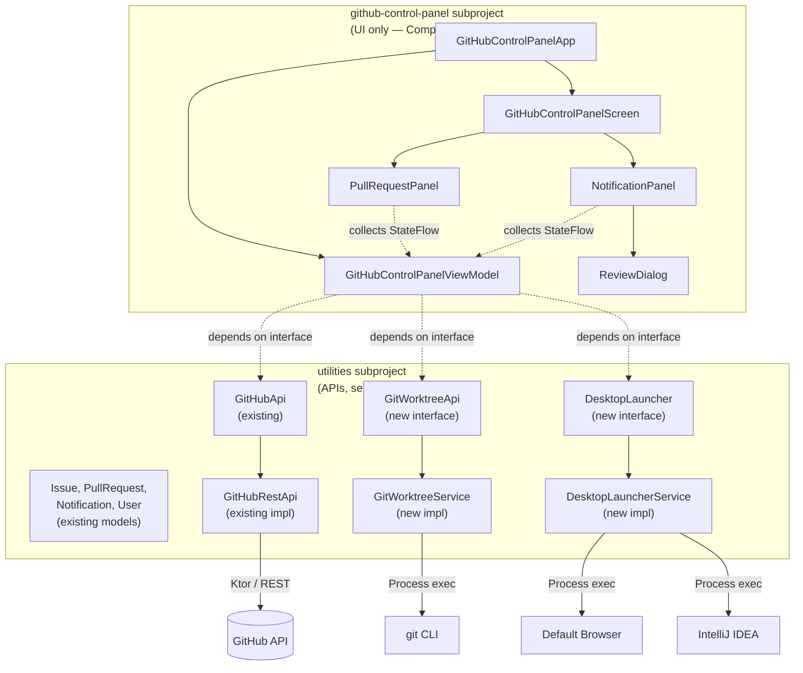
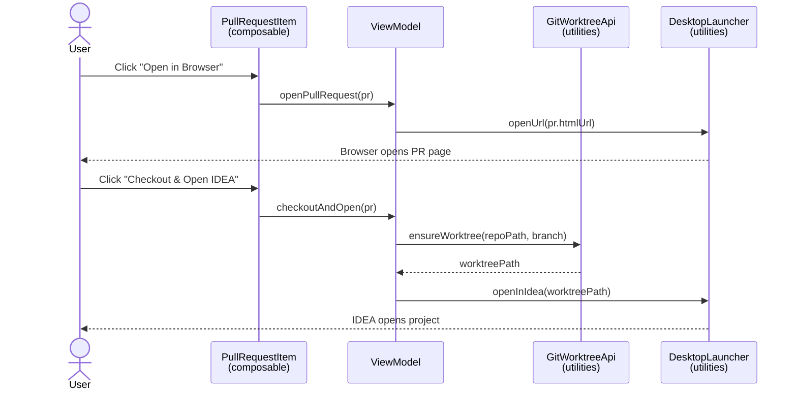
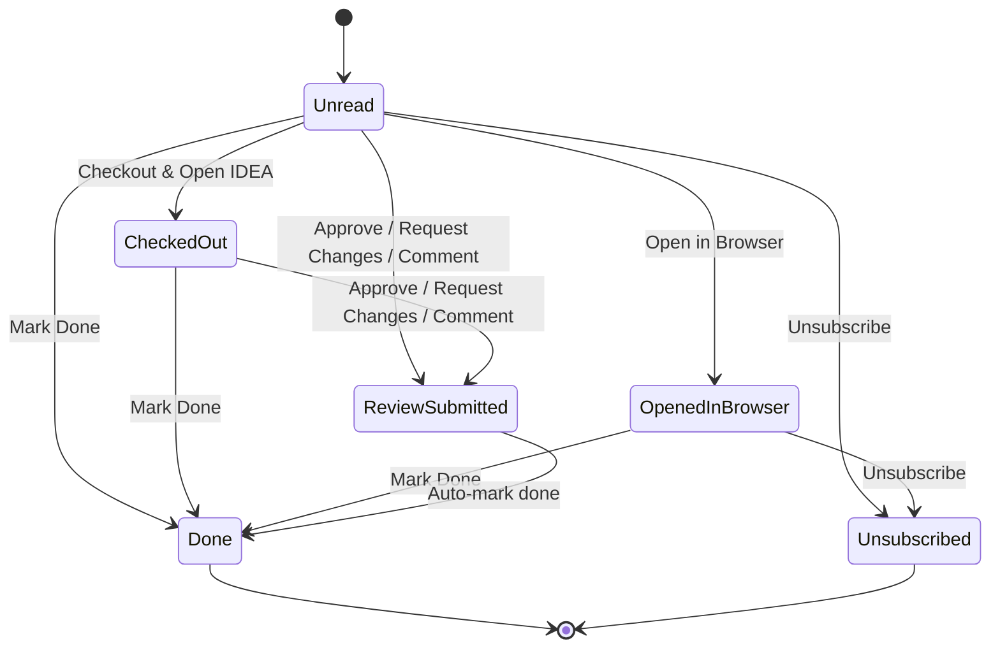
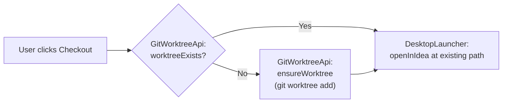
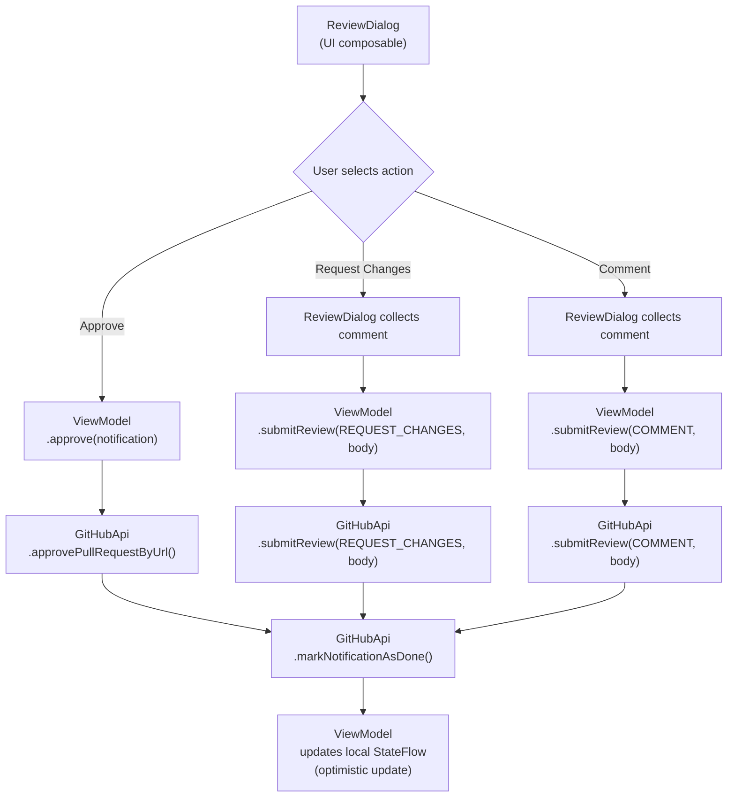

- [TODO](#todo)
- [GitHub Control Panel (Planned)](#github-control-panel-planned)
    - [Design Principles](#design-principles)
    - [Architecture](#architecture)
    - [UI Layout](#ui-layout)
    - [Open Pull Requests Panel](#open-pull-requests-panel)
    - [Unread Notifications Panel](#unread-notifications-panel)
    - [Interaction Flows](#interaction-flows)
    - [New Utilities APIs (added to utilities subproject)](#new-utilities-apis-added-to-utilities-subproject)
    - [Subproject Structure](#subproject-structure)
- [Overview](#overview)
  - [Utilities](#utilities)
  - [Summary Publisher](#summary-publisher)
  - [User Metrics Publisher](#user-metrics-publisher)
  - [Location for configuration files](#location-for-configuration-files)
    - [Users and teams](#users-config)
    - [Summary publisher config](#summary-publisher-config)
    - [User metrics publisher config](#user-metrics-publisher-config)

# TODO

* [ ] Create native executables
* [ ] Add dependency injection
* [ ] Consider consolidating into a single configuration file

# GitHub Control Panel (Planned)

A Kotlin Native desktop application (new Gradle subproject: `github-control-panel`) that provides a unified dashboard
for managing GitHub pull requests and notifications. It integrates with `git worktree` and IntelliJ IDEA for fast
context switching between branches.

**Key constraint:** The `github-control-panel` subproject contains **only UI code** (Compose composables and UI state).
All API clients, platform services, and business logic live in the `utilities` subproject, which already provides
`GitHubApi`/`GitHubRestApi`, `Notification`, `Issue`, `PullRequest`, and related models. New non-UI capabilities
(check-run queries, git worktree management, browser/IDEA launching) are added as interfaces and implementations in
`utilities` so they remain reusable across all subprojects.

## Design Principles

Guided by *The Pragmatic Programmer* and *Software Architecture: The Hard Parts*:

| Principle                        | Application                                                                                                                                                                      |
|----------------------------------|----------------------------------------------------------------------------------------------------------------------------------------------------------------------------------|
| **DRY / Single Source of Truth** | GitHub API logic lives only in `utilities`. The UI subproject never makes HTTP calls directly.                                                                                   |
| **Depend on Abstractions**       | The UI depends on interfaces (`GitHubApi`, `GitWorktreeApi`, `DesktopLauncher`) defined in `utilities`. Implementations are injected, never imported directly.                   |
| **Orthogonality**                | Each component has one reason to change. A composable knows how to render; a service knows how to call an API. They never cross.                                                 |
| **Tracer Bullets**               | Build a minimal vertical slice first (one PR row, one notification row) that proves the full path from API to screen.                                                            |
| **Decoupled Architecture**       | The UI subproject has zero knowledge of Ktor, HTTP, or JSON. It receives domain models and calls interface methods. Swapping REST for GraphQL requires zero UI changes.          |
| **Data Fitness Function**        | UI state classes (`PullRequestUiState`, `NotificationUiState`) are distinct from API models. Mapping happens at the boundary, keeping each layer's contracts clean.              |
| **Service Granularity**          | Avoid a single god-service. `GitHubApi` handles GitHub REST. `GitWorktreeApi` handles worktrees. `DesktopLauncher` handles open-in-browser/IDEA. Each is independently testable. |

## Architecture



### Dependency Direction

```
┌─────────────────────────┐
│   github-control-panel  │  UI composables + UI state only
│   (Compose Desktop)     │
└────────────┬────────────┘
             │ depends on (interfaces + models)
             ▼
┌─────────────────────────┐
│       utilities          │  Interfaces, implementations,
│   (Kotlin Multiplatform) │  domain models, platform services
└─────────────────────────┘
```

The arrow always points downward. The UI subproject never exposes anything that `utilities` consumes.
`utilities` has zero awareness that a UI exists.

All composables interact with `utilities` through the `GitHubControlPanelViewModel`. Composables never hold
references to API interfaces directly — they collect `StateFlow` for read data and call ViewModel methods for
user-initiated actions (open in browser, checkout, approve, etc.). The ViewModel delegates to the injected
`utilities` interfaces.

## UI Layout

```
┌──────────────────────────────────────────────────────────────────────┐
│  GitHub Control Panel                                                │
├──────────────────────────────────────────────────────────────────────┤
│                                                                      │
│  ┌─── Open Pull Requests ───────────────────────────────────────┐   │
│  │                                                               │   │
│  │  PR #142  feat: add caching layer              CI Passed      │   │
│  │  repo: my-org/api-service                   1/2 Approved      │   │
│  │  [Open in Browser]  [Checkout & Open IDEA]                    │   │
│  │                                                               │   │
│  │  PR #87   fix: null pointer in auth flow       CI Failed      │   │
│  │  repo: my-org/auth-lib                      0/1 Approved      │   │
│  │  [Open in Browser]  [Checkout & Open IDEA]                    │   │
│  │                                                               │   │
│  │  PR #201  chore: bump dependencies             CI Running     │   │
│  │  repo: my-org/frontend                      1/1 Approved      │   │
│  │  [Open in Browser]  [Checkout & Open IDEA]                    │   │
│  │                                                               │   │
│  └───────────────────────────────────────────────────────────────┘   │
│                                                                      │
│  ┌─── Unread Notifications ─────────────────────────────────────┐   │
│  │                                                               │   │
│  │  Review requested: PR #305 "migrate to coroutines"            │   │
│  │     my-org/core-lib                                           │   │
│  │     [Open in Browser] [Checkout & Open IDEA]                  │   │
│  │     [Approve] [Request Changes] [Comment]                     │   │
│  │     [Mark Done] [Unsubscribe]                                 │   │
│  │                                                               │   │
│  │  Mentioned in issue #88 "Flaky test in CI"                    │   │
│  │     my-org/api-service                                        │   │
│  │     [Open in Browser]                                         │   │
│  │     [Mark Done] [Unsubscribe]                                 │   │
│  │                                                               │   │
│  │  CI failed on PR #142 "feat: add caching layer"               │   │
│  │     my-org/api-service                                        │   │
│  │     [Open in Browser] [Checkout & Open IDEA]                  │   │
│  │     [Mark Done] [Unsubscribe]                                 │   │
│  │                                                               │   │
│  └───────────────────────────────────────────────────────────────┘   │
│                                                                      │
└──────────────────────────────────────────────────────────────────────┘
```

## Open Pull Requests Panel

Displays all open PRs authored by the authenticated user. Each PR shows:

| Field             | Existing `utilities` API                                                      | New API needed in `utilities`                                           |
|-------------------|-------------------------------------------------------------------------------|-------------------------------------------------------------------------|
| PR number & title | `GitHubApi.searchPullRequestsByText()` returns `Issue` with `number`, `title` | `getOpenPullRequestsByAuthor()` -- new method                           |
| Repository        | `Issue.repositoryUrl`                                                         | --                                                                      |
| CI/CD status      | --                                                                            | `getCheckRunsForRef()` -- new method                                    |
| Review status     | `GitHubApi.hasAnyApprovedReview()` (boolean)                                  | `getReviewSummary()` -- new method returning approval count vs required |

**PR status categories:**

| Status         | Meaning                                 |
|----------------|-----------------------------------------|
| CI Passed      | All check runs succeeded                |
| CI Failed      | One or more check runs failed           |
| CI Running     | Checks still in progress                |
| N/M Approved   | N approvals out of M required reviewers |
| Waiting        | No approvals yet                        |
| Merge Conflict | Branch has conflicts with base          |

**Actions per PR:**

- **Open in Browser** -- calls `DesktopLauncher.openUrl(pr.htmlUrl)` (interface in `utilities`)
- **Checkout & Open IDEA** -- calls `GitWorktreeApi.ensureWorktree(repo, branch)` then
  `DesktopLauncher.openInIdea(path)` (interfaces in `utilities`)



## Unread Notifications Panel

Displays unread GitHub notifications using the existing `GitHubApi.listNotifications()` which returns
`List<Notification>`.

**Notification fields (already in `utilities` models):**

| Field      | Model property                                                       |
|------------|----------------------------------------------------------------------|
| Reason     | `Notification.reason` (review_requested, mention, ci_activity, etc.) |
| Subject    | `Notification.subject.title`                                         |
| Repository | `Notification.repository.fullName`                                   |
| Type       | `Notification.subject.type` (PullRequest, Issue, etc.)               |

**Actions per notification:**

| Action                   | Implementation                                                                             |
|--------------------------|--------------------------------------------------------------------------------------------|
| **Open in Browser**      | `DesktopLauncher.openUrl(notification.subject.htmlUrl)` (utilities interface)              |
| **Checkout & Open IDEA** | `GitWorktreeApi.ensureWorktree()` + `DesktopLauncher.openInIdea()` (PR notifications only) |
| **Approve**              | `GitHubApi.approvePullRequestByUrl()` (existing in utilities)                              |
| **Request Changes**      | New: `GitHubApi.submitReview(url, REQUEST_CHANGES, body)` (added to utilities)             |
| **Comment**              | New: `GitHubApi.submitReview(url, COMMENT, body)` (added to utilities)                     |
| **Mark Done**            | `GitHubApi.markNotificationAsDone()` (existing in utilities)                               |
| **Unsubscribe**          | `GitHubApi.unsubscribeFromNotification()` (existing in utilities)                          |

Review actions (Approve / Request Changes / Comment) are only shown for notifications where
`subject.type == "PullRequest"`.



## Interaction Flows

### Git Worktree Strategy

All branch checkouts use `git worktree` to avoid disrupting the current working directory.
The `GitWorktreeApi` interface (in `utilities`) encapsulates all worktree operations:

```
~/git/
├── my-repo/                  # main worktree (your working copy)
├── my-repo-pr-142/           # worktree for PR #142
├── my-repo-pr-305/           # worktree for PR #305
└── dev-lake-utils/           # this project
```



### Review Flow

The UI composable (`ReviewDialog`) collects user input, then delegates entirely to `GitHubApi` methods in `utilities`:



## Data Refresh Strategy

The UI stays current through **polling** — periodic re-fetching of GitHub data on a configurable interval.
The implementation uses the idiomatic Kotlin coroutine pattern: `Flow` → `StateFlow` → `collectAsState()`.

### ViewModel & Coroutine Architecture

`GitHubControlPanelViewModel` extends Compose Multiplatform's `ViewModel` (from `lifecycle-viewmodel-compose`),
which provides `viewModelScope` — a `CoroutineScope` backed by `SupervisorJob() + Dispatchers.Main.immediate`.

```
┌──────────────────────────────────────────────────────────────────┐
│  Composable Layer                                                │
│  PullRequestPanel · NotificationPanel                            │
│  collects StateFlow via collectAsState()                         │
│  calls ViewModel methods for user actions                        │
└──────────────────────────┬───────────────────────────────────────┘
                           │ StateFlow<Result<List<UiState>>>
                           │ action methods (checkout, approve, …)
┌──────────────────────────┴───────────────────────────────────────┐
│  GitHubControlPanelViewModel                                      │
│  viewModelScope (SupervisorJob + Dispatchers.Main.immediate)     │
│                                                                   │
│  pullRequests: StateFlow  ← pollPullRequests().stateIn(…)        │
│  notifications: StateFlow ← pollNotifications().stateIn(…)       │
└──────────────────────────┬───────────────────────────────────────┘
                           │ suspend calls via flowOn(Dispatchers.IO)
┌──────────────────────────┴───────────────────────────────────────┐
│  utilities interfaces                                             │
│  GitHubApi · GitWorktreeApi · DesktopLauncher                    │
└──────────────────────────────────────────────────────────────────┘
```

### Polling Flow Pattern

Each data source is an independent `Flow` that emits on a fixed interval, shifted to `Dispatchers.IO` via
`flowOn`, with retry and error handling via Flow operators:

```kotlin
private fun pollPullRequests(intervalMs: Long): Flow<Result<List<PullRequestUiState>>> = flow {
    while (true) {
        emit(Result.success(fetchAndMapPullRequests()))
        delay(intervalMs)
    }
}.flowOn(Dispatchers.IO)
 .retryWhen { cause, attempt ->
     if (cause is IOException && attempt < 5) {
         delay(1000L * (1L shl attempt.toInt()))
         true
     } else false
 }.catch { emit(Result.failure(it)) }

val pullRequests: StateFlow<Result<List<PullRequestUiState>>> =
    pollPullRequests(60_000L).stateIn(
        scope = viewModelScope,
        started = SharingStarted.WhileSubscribed(5_000),
        initialValue = Result.success(emptyList())
    )
```

Pull requests and notifications are **separate `StateFlow`s**. Because `viewModelScope` uses `SupervisorJob`,
a failure in one polling flow does not cancel the other.

### Threading Model

| Concern                   | Dispatcher            | Mechanism                                      |
|---------------------------|-----------------------|------------------------------------------------|
| GitHub API calls          | `Dispatchers.IO`      | `flowOn(Dispatchers.IO)` in polling flows      |
| Git worktree CLI exec     | `Dispatchers.IO`      | Inside `GitWorktreeService` implementation     |
| Domain → UI model mapping | `Dispatchers.Default` | `.map { … }` in the flow pipeline              |
| UI state delivery         | `Dispatchers.Main`    | `stateIn(viewModelScope)` + `collectAsState()` |

`Dispatchers.Main` on JVM/Desktop requires the `kotlinx-coroutines-swing` dependency.

### Lifecycle & Cancellation

`SharingStarted.WhileSubscribed(5_000)` ties polling to the composable lifecycle:

```
Window closed
  → Composition disposed
    → collectAsState() collector removed
      → WhileSubscribed detects 0 subscribers (after 5s grace period)
        → stateIn cancels upstream flow
          → delay() throws CancellationException → polling loop exits cleanly
```

No manual cleanup is required. The 5-second grace period avoids unnecessary restart during transient
recomposition. `delay()` is cancellation-cooperative, so the `while(true)` loop terminates immediately on scope
cancellation.

### Optimistic Updates

After user actions that mutate server state (approve, mark done, unsubscribe), the ViewModel immediately
updates the local `StateFlow` value to reflect the expected change without waiting for the next poll cycle.
The next poll reconciles with actual server state.

## New Utilities APIs (added to utilities subproject)

These interfaces and implementations are added to `utilities`, keeping the control panel subproject free of non-UI
logic.

### GitWorktreeApi (new interface)

```
com.github.karlsabo.git.GitWorktreeApi
```

| Method                                      | Description                                              |
|---------------------------------------------|----------------------------------------------------------|
| `ensureWorktree(repoPath, branch): Path`    | Creates a worktree if it doesn't exist, returns the path |
| `worktreeExists(repoPath, branch): Boolean` | Checks if a worktree already exists for the branch       |
| `listWorktrees(repoPath): List<Worktree>`   | Lists all active worktrees for a repo                    |
| `removeWorktree(worktreePath)`              | Removes a worktree and cleans up                         |

Implementation: `GitWorktreeService` -- wraps `git worktree` CLI commands via process execution.

### DesktopLauncher (new interface)

```
com.github.karlsabo.system.DesktopLauncher
```

| Method                          | Description                                                                                   |
|---------------------------------|-----------------------------------------------------------------------------------------------|
| `openUrl(url: String)`          | Opens a URL in the default browser (`open` on macOS, `xdg-open` on Linux, `start` on Windows) |
| `openInIdea(projectPath: Path)` | Launches IntelliJ IDEA at the given project path (`idea <path>`)                              |

Implementation: `DesktopLauncherService` -- uses platform-appropriate process execution. Leverages the existing
`osFamily()` from `com.github.karlsabo.system.Utils`.

### GitHubApi Additions (extend existing interface)

New methods added to the existing `com.github.karlsabo.github.GitHubApi` interface:

| Method                                                   | Description                                                                            |
|----------------------------------------------------------|----------------------------------------------------------------------------------------|
| `getOpenPullRequestsByAuthor(orgs, author): List<Issue>` | Fetches open PRs authored by a user across organizations                               |
| `getCheckRunsForRef(owner, repo, ref): CheckRunSummary`  | Returns CI/CD status for a commit SHA                                                  |
| `getReviewSummary(owner, repo, prNumber): ReviewSummary` | Returns approval count, requested reviewer count, and individual review states         |
| `submitReview(prUrl, event, body)`                       | Submits a review with event type (APPROVE, REQUEST_CHANGES, COMMENT) and optional body |

New models added to `utilities`:

| Model             | Fields                                                                       |
|-------------------|------------------------------------------------------------------------------|
| `CheckRunSummary` | `total`, `passed`, `failed`, `inProgress`, `status: CiStatus`                |
| `CiStatus` (enum) | `PASSED`, `FAILED`, `RUNNING`, `PENDING`                                     |
| `ReviewSummary`   | `approvedCount`, `requestedCount`, `reviews: List<ReviewState>`              |
| `ReviewState`     | `user`, `state` (APPROVED, CHANGES_REQUESTED, COMMENTED, PENDING, DISMISSED) |
| `Worktree`        | `path`, `branch`, `commitHash`                                               |

## Subproject Structure

New Gradle subproject: `github-control-panel` -- **UI code only**.

```
github-control-panel/
├── build.gradle.kts              # Compose Desktop plugin, depends on :utilities
├── readme.md
└── src/
    └── commonMain/
        └── kotlin/com/github/karlsabo/devlake/ghpanel/
            │
            ├── GitHubControlPanelApp.kt         # Entry point, Compose app wiring,
            │                                    # creates ViewModel with injected
            │                                    # utilities interfaces
            │
            ├── viewmodel/
            │   └── GitHubControlPanelViewModel.kt  # Owns polling flows, exposes
            │                                       # StateFlow<Result<…>> for PRs
            │                                       # and notifications, handles
            │                                       # user actions (checkout, approve,
            │                                       # mark done, etc.)
            │
            ├── screen/
            │   └── GitHubControlPanelScreen.kt  # Top-level screen composable,
            │                                    # collects StateFlows from ViewModel,
            │                                    # orchestrates panels
            │
            ├── component/
            │   ├── PullRequestPanel.kt          # Scrollable list of PR items
            │   ├── PullRequestItem.kt           # Single PR row: status, actions
            │   ├── NotificationPanel.kt         # Scrollable list of notification items
            │   ├── NotificationItem.kt          # Single notification row: reason,
            │   │                                # subject, actions
            │   ├── ReviewDialog.kt              # Modal for comment input on
            │   │                                # Request Changes / Comment
            │   └── StatusBadge.kt               # Reusable CI/review status chip
            │
            └── state/
                ├── PullRequestUiState.kt        # UI-layer model: maps from
                │                                # Issue + CheckRunSummary + ReviewSummary
                └── NotificationUiState.kt       # UI-layer model: maps from
                                                 # Notification + optional PR context
```

Additions to `utilities` (not a new subproject, extends existing code):

```
utilities/src/commonMain/kotlin/com/github/karlsabo/
├── git/
│   ├── GitWorktreeApi.kt            # Interface
│   └── GitWorktreeService.kt        # Implementation (git CLI process exec)
│
├── system/
│   ├── DesktopLauncher.kt           # Interface (openUrl, openInIdea)
│   └── DesktopLauncherService.kt    # Implementation (platform-aware process exec)
│
└── github/
    ├── GitHubApi.kt                 # Extended with new methods
    ├── GitHubRestApi.kt             # Implementation of new methods
    ├── CheckRunSummary.kt           # New model
    ├── CiStatus.kt                  # New enum
    ├── ReviewSummary.kt             # New model
    └── ReviewState.kt               # New model
```

**Dependencies:**

| Subproject             | Depends on                                                                                             | Adds                                                                                     |
|------------------------|--------------------------------------------------------------------------------------------------------|------------------------------------------------------------------------------------------|
| `utilities`            | Ktor, kotlinx.serialization, kotlinx.coroutines                                                        | New interfaces + implementations for git worktree, desktop launcher, extended GitHub API |
| `github-control-panel` | `:utilities`, Compose Multiplatform Desktop, `lifecycle-viewmodel-compose`, `kotlinx-coroutines-swing` | ViewModel, UI composables, UI state mappers. **No Ktor, no HTTP, no JSON.**              |

# Overview

This project makes direct API calls to GitHub, Jira, Linear, and PagerDuty to collect data and create summaries of
projects and
user metrics. By combining data from your development, project management, and incident response tools, it provides a
unified view of your team's performance, allowing you to track key metrics and gain insights into your workflows.

Whether you're looking to analyze code commits, issue tracking, or incident resolution times, this project empowers you
to see the full picture and make data-driven decisions to optimize your development processes.

The summaries are sent to Zapier, which then forwards them to Slack. The project consists of the following subprojects:

## Utilities

The [utilities](./utilities/readme.md) project contains common utilities used by other projects, such as user and team
creation.

## Summary Publisher

The [summary publisher](./summary-publisher/readme.md) project is responsible for summarizing and publishing project
information. It uses configurations defined in `summary-publisher-config.json` to manage different projects, their
leads, contributors, and related issue keys. The summaries are published to a specified Zapier URL.

## User Metrics Publisher

The [user metrics publisher](./user-metrics-publisher/readme.md) collects user metrics and sends a Slack report to that
user. It collects metrics such as pull requests and issues.

## Location for configuration files

* On Linux: `~/.local/share/DevLakeUtils`
* On macOS: `~/Library/Application Support/DevLakeUtils`
* On Windows: `%APPDATA%\DevLakeUtils`

### Users config

`users-config.json` contains the user mappings. The JSON format for
the [UsersConfig](./utilities/src/commonMain/kotlin/com/github/karlsabo/dto/UsersConfig.kt)
is as follows:

```json
{
  "users": [
    {
      "id": "name@example.local",
      "email": "name@example.local",
      "name": "John Doe",
      "slackId": "memberId01",
      "gitHubId": "johndoe",
      "jiraId": "john.doe"
    },
    {
      "id": "otherperson@example.local",
      "email": "otherperson@example.local",
      "name": "Jane Doe",
      "slackId": "memberId02",
      "gitHubId": "janedoe",
      "jiraId": "jane.doe"
    }
  ]
}
```

### Summary publisher config

`summary-publisher-config.json` contains the configuration for the summary publisher. The JSON format for
the [SummaryPublisherConfig](./summary-publisher/src/commonMain/kotlin/com/github/karlsabo/devlake/tools/SummaryPublisherConfig.kt)
is as follows:

```json
{
  "zapierSummaryUrl": "https://hooks.zapier.com/hooks/catch/123/abc/",
  "summaryName": "Our team",
  "isTerseSummaryUsed": true,
  "projects": [
    {
      "id": 1,
      "parentId": null,
      "title": "🐍 Cool project 1",
      "links": [
        "https://example.local/wiki/cool+project+1"
      ],
      "slackProjectChannel": "#cool-project",
      "projectLeadUserId": "john.doe@example.local",
      "projectContributors": [
        "jane.doe@example.local"
      ],
      "productManager": "joe.bob@example.local",
      "topLevelIssueKeys": [
        "JIRA-1234"
      ]
    },
    {
      "id": 2,
      "parentId": null,
      "title": "🌖 Moon shot",
      "links": [
        "https://example.local/wiki/moon+shot"
      ],
      "slackProjectChannel": "",
      "projectLeadUserId": "james.bond@example.local",
      "projectContributors": [],
      "productManager": "m@example.local",
      "topLevelIssueKeys": [
        "JIRA-234"
      ],
      "isVerboseMilestones": true,
      "isTagMilestoneOwners": true
    }
  ],
  "isMiscellaneousProjectIncluded": true,
  "gitHubOrganizationIds": ["example-org"],
  "pagerDutyServiceIds": ["ABCDEF"],
  "miscUserIds": ["john.doe@example.local"]
}
```

### User metrics publisher config

`user-metric-publisher-config.json` contains the configuration for the user metrics publisher. The JSON format for
the [UserMetricPublisherConfig](user-metrics-publisher/src/commonMain/kotlin/com/github/karlsabo/devlake/metrics/UserMetricPublisherConfig.kt)
is as follows:

```json
{
  "userIds": [
    "jane.doe@example.local"
  ],
  "organizationIds": [
    "example-org"
  ],
  "zapierMetricUrl": "https://hooks.zapier.com/hooks/catch/123/abc/",
  "metricInformationPostfix": "\n━━━━━━━━━━━━━━━━━━\n\n💡 *Why do we track these metrics?*  \nWe use these to *track our progress toward milestones* and ensure we are on pace to meet our goals. 📈\n\n🔗 *Helpful Links:*\n• 📜 <https://medium.com/@jamesacowling/stepping-stones-not-milestones-e6be0073563f#:~:text=The%20key%20thing%20about%20a,unknowns%20start%20to%20fall%20away.|Stepping stones, not milestones>\n• 🛠️ <https://ronjeffries.com/articles/019-01ff/story-points/Index.html|Slice stories down>\n• 📊 <https://jacobian.org/2021/may/25/my-estimation-technique/|Estimation technique>\n"
}
```

