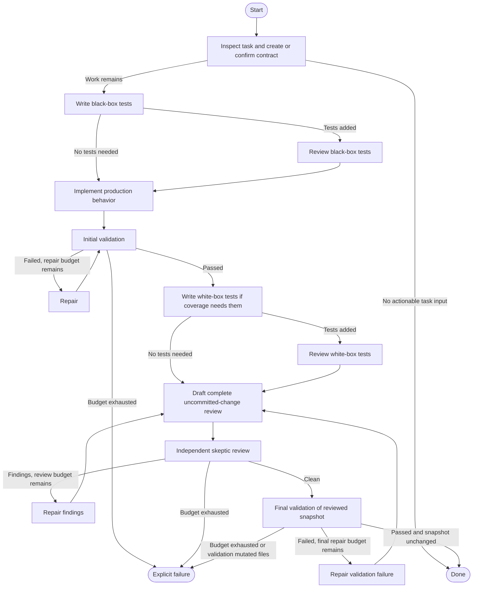

# WIP EH implement extension

This extension runs an implementation workflow as isolated, tool-capable Pi subagents. Decisions use structured output and host-validated review evidence rather than prose claims.



Each state starts a separate `pi` process in the current repository with the active model and thinking level. States first determine whether their narrow responsibility applies and avoid edits, broad rediscovery, and unrelated commands when it does not. An empty planned-comments or review-comments artifact ends the workflow after the initial direct inspection. Test-review states run only when their corresponding test-writing state changed files, and finding-remediation states run only when findings exist. Validation and final review still run when actual implementation work remains.

Structured state responses may include a small evidence handoff containing cited mechanical facts, relevant paths, and commands already run. The host caps this retained context, rejects facts without readable repository-relative citations, and drops a fact when any cited file changes. Later prompts label retained evidence as untrusted research that must be verified. Review states receive paths and commands but not prior claims; the independent skeptic receives no handoff context. This reduces repeated repository discovery without reusing prior conversations or reasoning.

The orchestrator invokes the draft and skeptic reviews as separate states. It does not trust the draft reviewer to self-delegate. The host defines the scope from the complete current uncommitted worktree, validates a unique current-attempt planned-comments artifact, and derives surviving inline findings from that artifact. A clean artifact requires an empty inline section and the exact overall comment `No actionable findings.`; every actionable finding must instead be a structured inline comment. Changed submodules are rejected because their nested worktrees cannot be covered by the parent repository fingerprint.

Final review includes every changed and untracked path, including paths dirty before the workflow started. The starting snapshot records provenance; it never excludes content from review. Review prompts also require impact analysis of relevant unchanged callers, consumers, tests, configuration, documentation, and documented commands.

Success applies to one worktree fingerprint: both review passes leave it unchanged, the skeptic artifact is clean, required validation passes, and validation leaves the reviewed fingerprint unchanged. Every repair mutation—including a repair after final validation—returns through both final review passes. Unexpected mutation by a review or validation state fails explicitly.

Three independent finite budgets cap initial-validation repairs, final-validation repairs, and review repairs. They do not reset when the convergence loop switches between review and validation. A zero budget still runs the check but permits no repair. Exhaustion is a failed run, not partial success. Review artifacts live in a private per-run temporary directory and are deleted during workflow teardown; validated artifact contents are copied into the state audit first so the evidence used for the decision remains available. Successful and failed runs are stored as one `wip-eh-implement-result` session entry after teardown; failures retain the completed state audit and consumed repair counts, and any review-evidence or outer teardown failures are included without replacing the primary workflow audit.

The command waits for the current agent to become idle and rejects overlapping workflow invocations. While it runs, a widget shows the active state and elapsed time. The workflow reads `../notes.md`, honors applicable `AGENTS.md` instructions, and uses the globally installed `eh-pr-review` guidance when available. Normal requests remain limited to one acceptance-test slice; a planned-comments remediation batch may contain multiple supported findings.

## Install

From the repository root:

```bash
pi install ./llm/wip-eh-implement-extension/index.ts
```

Restart Pi or run `/reload` after changing the extension. For a one-off run:

```bash
pi -e ./llm/wip-eh-implement-extension/index.ts
```

## Run

Invoke from the repository to modify:

```text
/wip-eh-implement implement one narrowly scoped behavior
```

## Test

```bash
cd llm/wip-eh-implement-extension
npm test
npm run typecheck
```
