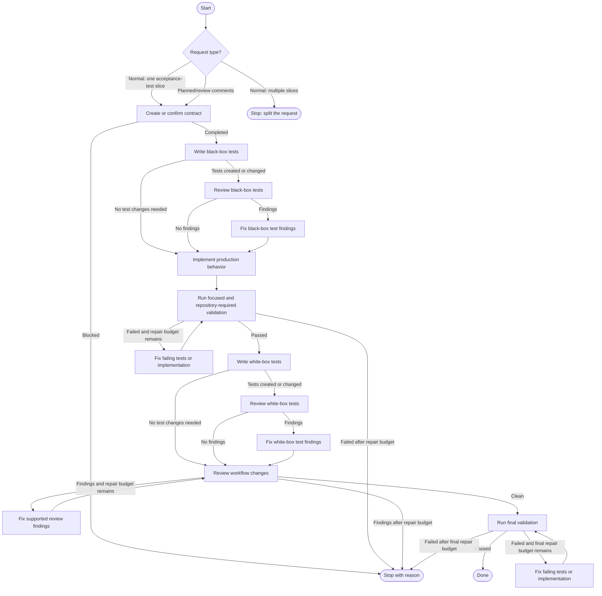

# WIP EH implement extension

This extension runs an implementation workflow as a sequence of isolated, tool-capable Pi subagents. Decisions use structured subagent output rather than guessing from prose summaries.



Each state starts a separate `pi` process in the current repository with the active model and thinking level. Worker states can read and edit files or run commands. Test-writing states report whether they changed repository files; when they report that no tests were needed, the associated test-review and test-fix states are skipped. Review states return structured findings, and fix states run only when findings exist. Validation and change-review repair loops are capped at two attempts. Final validation receives its own repair budget.

The command waits for the current agent to become idle and rejects overlapping workflow invocations. While it runs, a persistent widget below the editor shows the active workflow state and elapsed time. It snapshots pre-existing dirty files before work starts so final review includes only the workflow's additional changes to those files.

The workflow reads `../notes.md`, honors repository `AGENTS.md` instructions, and applies the `eh-pr-review` guidance during final review when that skill is installed globally. Normal implementation requests are rejected when they contain multiple acceptance-test slices. Planned-comments and review-comments artifacts are treated as review-remediation batches instead: each supported comment is evaluated and fixed independently.

## Install

Register the extension globally:

```bash
pi install dev-lake-utils:llm/wip-eh-implement-extension/index.ts
```

Restart Pi or run `/reload` after changing the extension.

For a one-off test:

```bash
pi -e dev-lake-utils:llm/wip-eh-implement-extension/index.ts
```

## Run

Invoke the workflow from the repository to modify:

```text
/wip-eh-implement implement one narrowly scoped behavior
```

The command runs through the complete workflow without placing a plan in the editor or requiring another Enter press. It modifies the current worktree, runs repository-required validation, and stores a `wip-eh-implement-result` entry in the current Pi session.

## Test

```bash
cd dev-lake-utils:llm/wip-eh-implement-extension
npm test
```
