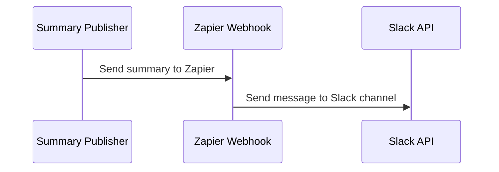
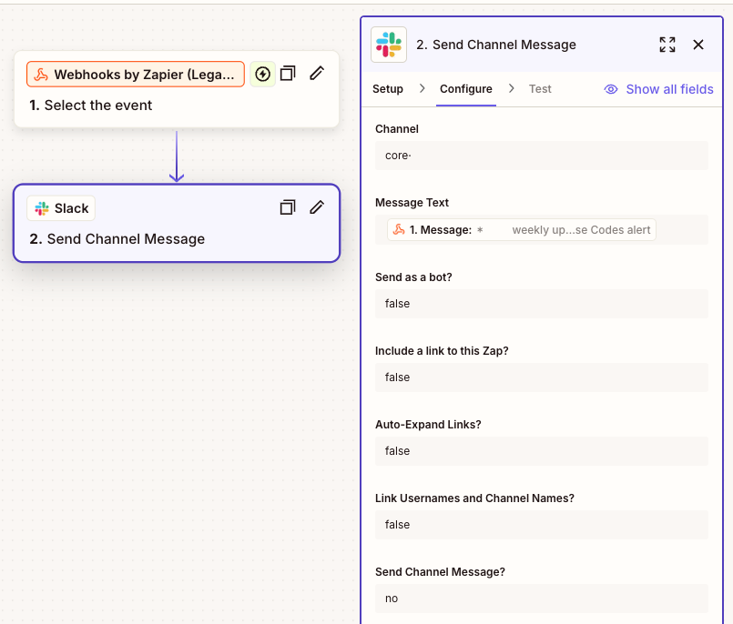

- [Introduction](#introduction)
    - [How to run the application](#how-to-run-the-application)
    - [Sequence for this publisher to Zap and then Slack](#sequence-for-this-publisher-to-zap-and-then-slack)
- [Example Zapier Webhook](#example-zapier-webhook)

# Introduction

This project pulls data from DevLake and creates a summary for projects. The summary is sent to Zapier, which then
forwards it to Slack. It uses configurations defined
in [summary-publisher-config.json](../README.md#summary-publisher-config).

## How to run the application

* `./gradlew summary-publisher:run` from the repository root.
* Edit the summary report in the UI
* 
* Click the `Publish to Slack` button to call the Zapier webhook.

## Sequence for this publisher to Zap and then Slack

## Example Zapier Webhook

*  
