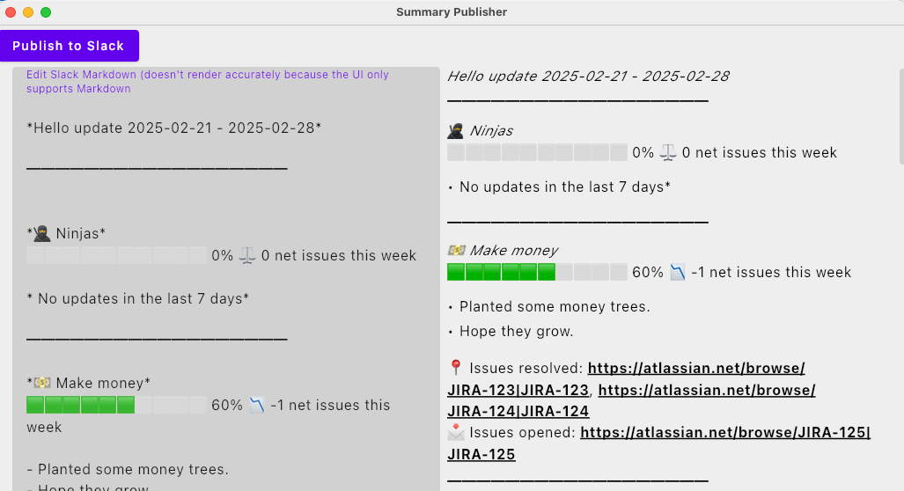
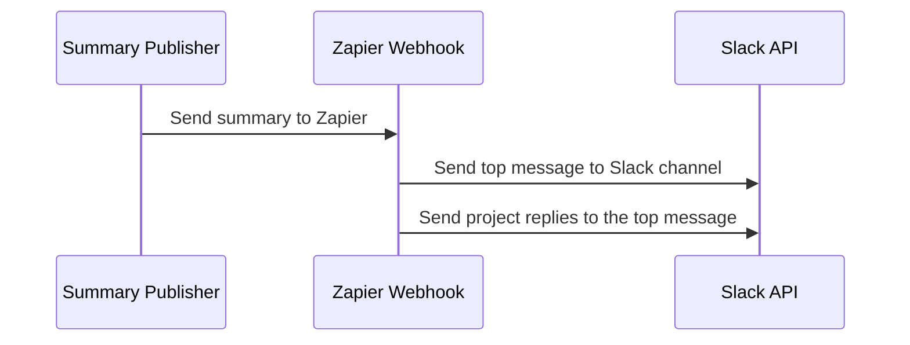
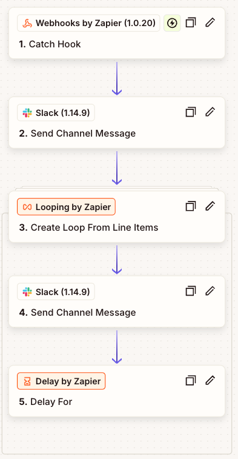

- [Introduction](#introduction)
    - [How to run the application](#how-to-run-the-application)
    - [Sequence for this publisher to Zap and then Slack](#sequence-for-this-publisher-to-zap-and-then-slack)
- [Example Zapier Webhook](#example-zapier-webhook)

# Introduction

This project makes direct API calls to GitHub, Jira, and PagerDuty to collect data and create summaries for projects.
The summary is sent to Zapier, which then forwards it to Slack. It uses configurations defined
in [summary-publisher-config.json](../README.md#summary-publisher-config).

## How to run the application

* `./gradlew summary-publisher:run` from the repository root.
* Edit the summary report in the UI
* 
* Click the `Publish to Slack` button to call the Zapier webhook.

## Sequence for this publisher to Zap and then Slack

The Summary Publisher sends a top-level message with a summary of all projects, followed by individual project messages as replies to the top message. This allows for a cleaner and more organized presentation in Slack, with the main summary at the top and detailed project information in the replies.

## Project Configuration Features

The Summary Publisher supports several configuration options for projects:

* **Verbose Milestone Details**: Set `isVerboseMilestones` to true in your project configuration to include detailed milestone information such as last update time, percent complete, and other project-like metrics.
* **Tag Milestone Owners**: Set `isTagMilestoneOwners` to true to include tags for milestone owners in the summary.
* **Additional Project Details**: You can configure various project details such as:
  * Product Manager
  * Slack Project Channel
  * Project Links
  * Project Lead and Contributors

These configuration options allow for more customized and informative project summaries.

## Example Zapier Webhook

