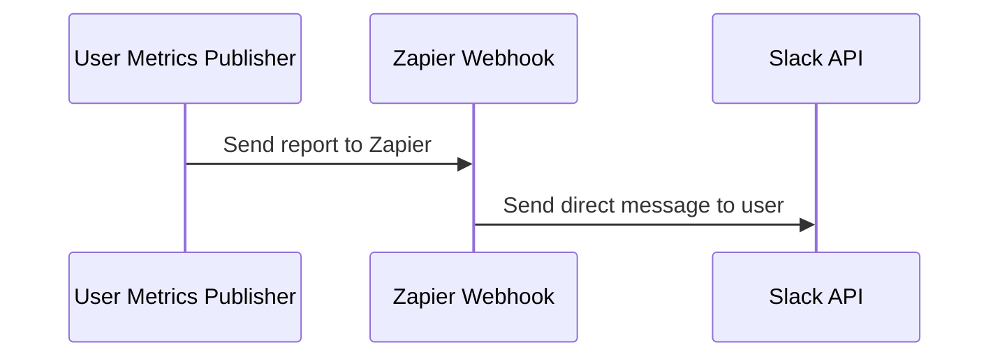
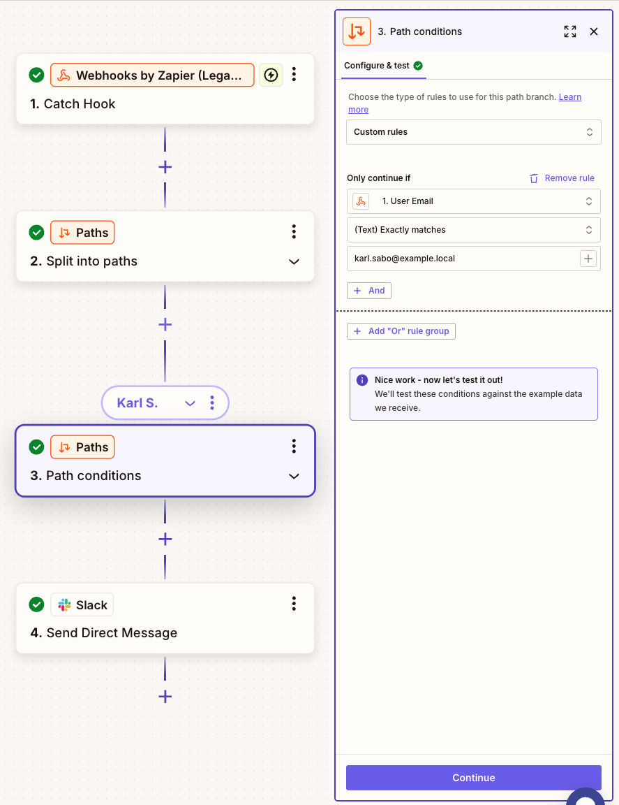
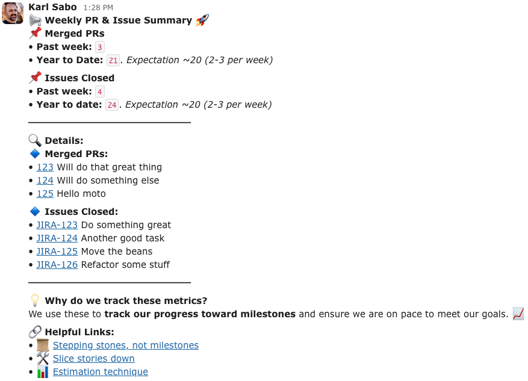

- [Introduction](#introduction)
  - [How to run the application](#how-to-run-the-application)
  - [Sequence for this publisher to Zap and then Slack](#sequence-for-this-publisher-to-zap-and-then-slack)
- [Example Zapier Webhook](#example-zapier-webhook)
- [Example Slack Post](#example-slack-post)
- [Useful postfix information](#useful-postfix-information)

# Introduction

This project makes direct API calls to GitHub, Jira, and PagerDuty to collect data and create summaries for users. The
summary is sent to Zapier, which then forwards it to Slack. It uses configurations defined
in [user-metric-publisher-config.json](../README.md#user-metrics-publisher-config).

## How to run the application

* `./gradlew user-metrics-publisher:run` from the repository root.
* Click the `Publish to Slack` button to call the Zapier webhook.
* 

## Sequence for this publisher to Zap and then Slack

# Example Zapier Webhook

* Create a Zapier webhook, split it into paths based on the user's email, and send the data to Slack.
* 
* Send a direct message to the Slack user

# Example Slack Post

# Useful postfix information

━━━━━━━━━━━━━━━━━━

💡 *Why do we track these metrics?*  
We use these to *track our progress toward milestones* and ensure we are on pace to meet our goals. 📈

🔗 *Helpful Links:*

*
📜 [Stepping stones, not milestones](https://medium.com/@jamesacowling/stepping-stones-not-milestones-e6be0073563f#:~:text=The%20key%20thing%20about%20a,unknowns%20start%20to%20fall%20away.)
* 🛠 [Slice stories down](https://ronjeffries.com/articles/019-01ff/story-points/Index.html)
* 📊 [Estimation technique](https://jacobian.org/2021/may/25/my-estimation-technique/)
